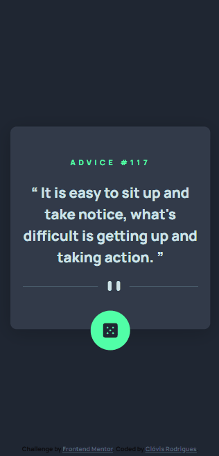

# Sobre o Projeto
Projeto clone do desafio [FrontEnd Mentor](https://www.frontendmentor.io/challenges/news-homepage-H6SWTa1MFl), nesse projeto foi utilizado a API [Advice Slip API](https://api.adviceslip.com/) para gerar os conselhos dinâmicos ao clicar no icone de dado.

## Desing Mobile	

## Design Desktop

## Tecnologias utilizadas
* HTML
* CSS
* JS
